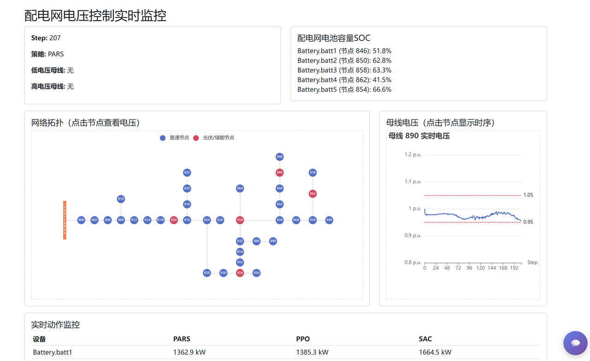
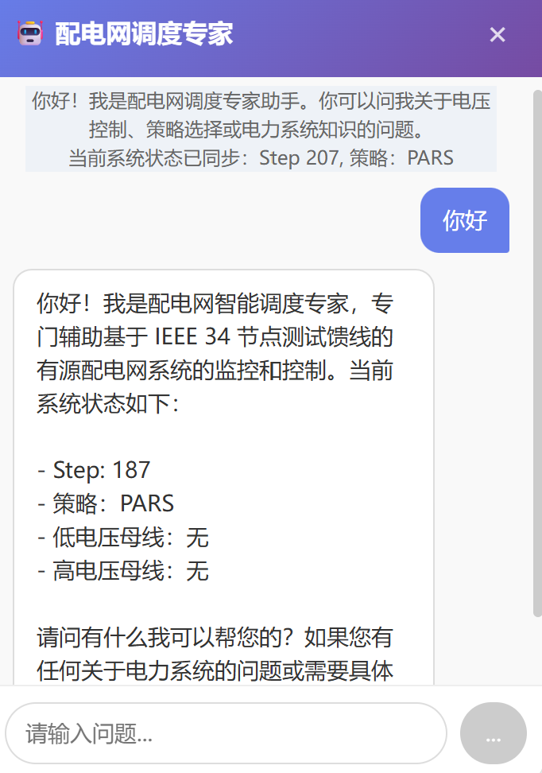
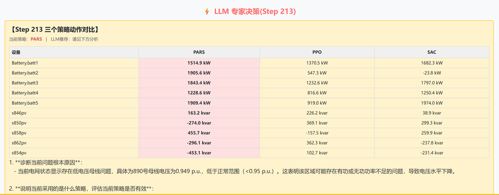
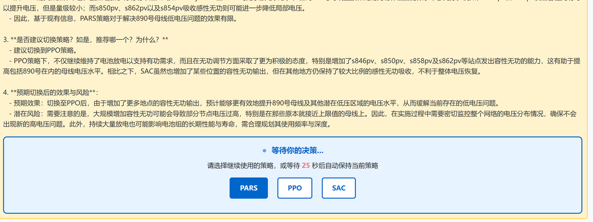

# PowerGym Volt-Var Control with LLM V1.0 系统说明文档

## 目录
- [系统简介](#系统简介)
- [主要模块说明](#主要模块说明)
  - [1. app.py](#1-apppy)
  - [2. test.py](#2-testpy)
  - [3. 前端界面 (templates/index.html)](#3-前端界面-templatesindexhtml)
  - [4. 其他核心模块](#4-其他核心模块)
- [系统运行流程](#系统运行流程)
- [前端界面设计说明](#前端界面设计说明)
- [文件结构简述](#文件结构简述)

---

## 系统简介
本系统基于 PowerGym 配电网仿真环境，集成了多种控制策略（LSTM/PARS、PPO、SAC），并结合大语言模型（LLM，如 DeepSeek）实现智能辅助决策。系统支持前后端分离，前端可视化监控电网状态、策略动作及 LLM 专家建议，用户/调度员可通过网页交互参与策略切换。

---

## 主要模块说明

### 1. app.py
- **作用**：系统主入口，基于 Flask + Flask-SocketIO 实现 Web 服务。
- **功能**：
  - 启动 test.py 仿真子进程，负责与其通信（stdout/stderr/stdin）。
  - 提供网页端接口（如 /、/api/topology）。
  - 通过 SocketIO 实时推送仿真状态、LLM 响应、接收用户决策。
  - 集成 LLM 聊天助手，支持上下文问答。

### 2. test.py
- **作用**：核心仿真与控制逻辑。
- **功能**：
  - 初始化 PowerGym 环境，加载/测试多种控制策略（PARS/LSTM、PPO、SAC）。
  - 检测电压/SOC异常时，自动触发 LLM 分析，暂停仿真并等待用户决策。
  - 通过 stdout 输出仿真状态（SIM_STATE）和 LLM 响应（LLM_RESPONSE），通过 stdin 接收策略切换指令。
  - 负责动作归一化/还原、策略动作对比、仿真数据采集等。

### 3. 前端界面 (templates/index.html)
- **作用**：用户交互与可视化展示。
- **功能**：
  - 实时显示母线电压、SOC、各策略动作、LLM 专家建议。
  - 支持策略切换决策、倒计时、动作对比表格、拓扑与电压曲线可视化。
  - 集成 LLM 聊天助手，支持上下文问答。
  - 通过 Socket.IO 与后端实时通信。

### 4. 其他核心模块
- **MAPPO.py / MASAC.py / PPO.py / SAC.py**：多种强化学习控制策略实现。
- **policy_LSTM.py**：LSTM 策略网络定义。
- **env.py / env_register.py**：PowerGym 环境封装与注册。
- **LLM.py**：LLM（如 DeepSeek）调用接口。
- **topology_server.py**：拓扑结构提取与 API 支持。
- **systems/**：存放 IEEE34Bus 等配电网原始数据与负荷曲线。

---

## 系统运行流程
1. 启动 `app.py`，自动运行 `test.py` 仿真子进程。
2. `test.py` 初始化环境，依次运行基线与训练策略。
3. 检测到电压/SOC异常时，自动调用 LLM 生成专家建议，通过 stdout 输出 LLM_RESPONSE。
4. `app.py` 监听并推送状态/LLM 响应到前端。
5. 前端弹出决策面板，用户选择策略后，通过 SocketIO 发送决策，后端写入 test.py stdin。
6. test.py 根据用户决策切换策略，继续仿真。

---

## 前端界面设计说明
- **主界面**：
  - 顶部显示系统名称与监控标题。
  - 左侧：IEEE34BUS节点系统拓扑图（ECharts）、母线电压曲线。
  - 右侧：母线电压/SOC/动作表格、策略状态。
  - 下方：LLM 专家建议面板（异常时弹出），显示三策略动作对比、LLM 分析文本、策略切换按钮、倒计时。
  - 右下角：LLM 聊天助手悬浮窗，支持实时问答。
<center>
  
  
</center>

- **交互逻辑**：
  - 实时推送仿真状态、动作、LLM 响应。
  - 用户可在 LLM 面板选择策略，或随时与 LLM 聊天。
  - 支持拓扑节点点击、母线电压历史查看。
  
  

---

## 文件结构简述
```
app.py                  # Web服务主入口
chess.py                # 其他辅助模块
circuit.py              # 电路相关
env.py, env_register.py # 环境封装与注册
MAPPO.py, MASAC.py, PPO.py, SAC.py # 多种控制策略
policy_LSTM.py          # LSTM策略网络
LLM.py                  # LLM接口
loadprofile.py          # 负荷曲线处理
obserfilter.py          # 观测归一化
system_prompt.txt       # LLM系统提示词
TEST_FILE_COMM.py       # 通信测试
systems/                # IEEE34Bus等原始数据
  34Bus/                # 34节点系统数据
    loadshape/          # 负荷曲线csv
    SAC_model/          # SAC模型参数
templates/
  index.html            # 前端主页面
  topology.html         # 拓扑可视化页面
```

---

如需详细开发/二次集成说明，请参考各模块源码注释。